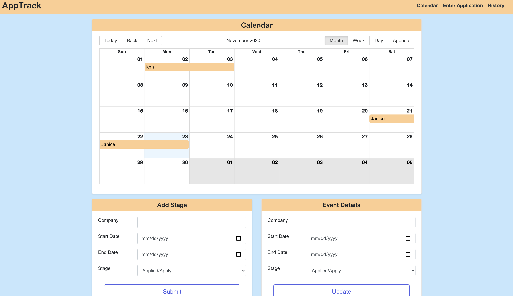
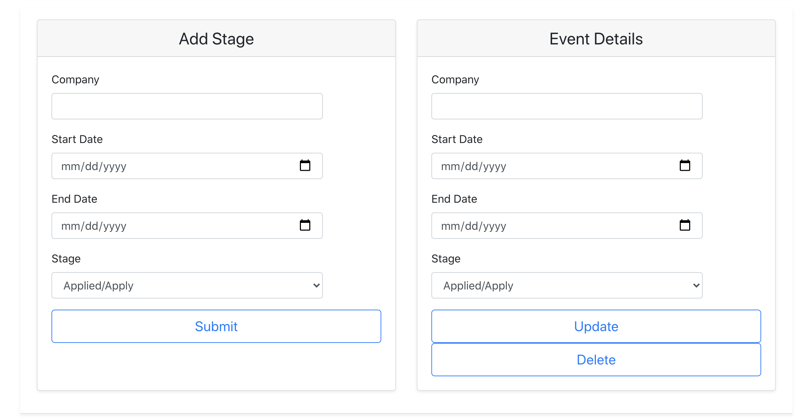
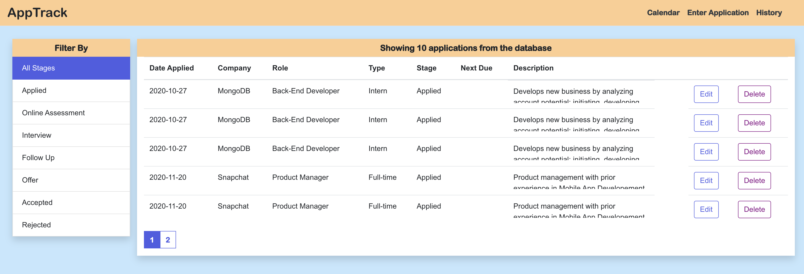

<h1 align="center">
🌐 Job Application Tracker
</h1>
<p align="center">
MongoDB, Expressjs, React, Nodejs
</p>

<p align="center">
   <a href="https://github.com/wirthdrewneu/AppTrack.git">
      Source Code
   </a>
</p>

> MERN is a fullstack implementation in MongoDB, Expressjs, React/Redux, Nodejs.

MERN stack is the idea of using Javascript/Node for fullstack web development.

## clone or download
```terminal
$ git clone https://github.com/wirthdrewneu/AppTrack.git
$ npm i
```

## project structure
<!-- ```terminal
LICENSE
package.json
server/
   package.json
   .env (to create .env, check [prepare your secret session])
client/
   package.json
...
``` -->

# Usage (run fullstack app on your machine)

## Prerequirements
- [MongoDB](https://gist.github.com/nrollr/9f523ae17ecdbb50311980503409aeb3)
- [Node](https://nodejs.org/en/download/) ^10.0.0
- [npm](https://nodejs.org/en/download/package-manager/)

notice, you need client and server runs concurrently in different terminal session, in order to make them talk to each other

## Client-side usage(PORT: 3000)
```terminal
$ npm i       // npm install pacakges
$ npm run dev // run it locally

// deployment for client app
$ npm run build // this will compile the react code using webpack and generate a folder called docs in the root level
$ npm run start // this will run the files in docs, this behavior is exactly the same how gh-pages will run your static site
```

## Server-side usage(PORT: 3001)
<!-- 
### Prepare your secret

run the script at the first level:

(You need to add a JWT_SECRET in .env to connect to MongoDB)

```terminal
// in the root level
$ echo "JWT_SECRET=YOUR_JWT_SECRET" >> ./server/src/.env
``` -->

### Start

```terminal
$ cd server   // go to server folder
$ npm i       // npm install pacakges
$ npm run dev // run it locally
$ npm run build // this will build the server code to es5 js codes and generate a dist file
```

## Deploy Server to [Heroku](https://dashboard.heroku.com/)
<!-- ```terminal
$ npm i -g heroku
$ heroku login
...
$ heroku create
$ npm run heroku:add <your-super-amazing-heroku-app>
// remember to run this command in the root level, not the server level, so if you follow the documentation along, you may need to do `cd ..`
$ pwd
/newApplication/<your-name>/mern
$ npm run deploy:heroku -->

## After creating heroku

<!-- remember to update the file of [client/webpack.prod.js](https://github.com/amazingandyyy/mern/blob/master/client/webpack.prod.js)
```javascript
 'API_URI': JSON.stringify('https://your-super-amazing-heroku-app.herokuapp.com')
``` -->

## Class Link:
https://johnguerra.co/classes/webDevelopment_fall_2020/
## Walk through video:

## Presentation:

## Project Objective:
Build a Web application using  MongoDB, Express, Node 
## Screenshots:






## Standard

[](https://github.com/standard/standard)


## Authors
[Andrew Wirth](https://github.com/wirthdrewneu) | [Harman Sidhu](https://github.com/harmanwho) 

### License
[MIT]()
